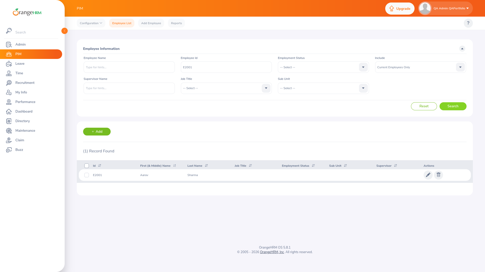

# OrangeHRM Manual QA — End-to-End Testing of an HR Management Platform

> Independent manual QA engagement against OrangeHRM 5.8.1 (self-hosted, pinned): charter → derived requirements → 54-case suite → traceability → evidence-backed execution → regression → final report.

[View Test Plan](docs/03-test-plan/test-plan.md) | [View Test Cases](docs/04-test-cases/test-case-design.md) | [View RTM](docs/05-traceability/rtm.md) | [View Bug Reports](bugs/) | [View Final Report](docs/07-final-report/final-qa-report.md)

## Snapshot

```text
App:         OrangeHRM Starter/Open Source 5.8.1 (orangehrm/orangehrm:5.8.1@sha256:5eb278ac…)
Type:        Manual QA (functional, smoke, regression, exploratory, BVA/EP, state, UI, compat)
Cases:       54 planned — 21 executed (38.9%): 17 Pass, 2 Fail*, 2 Blocked, 33 Not Run
Modules:     Auth, Dashboard, PIM/Employee, Profile, Leave, Time, Recruitment, Reports
Defects:     0 verified SUT defects (*2 Fails are test-design wording, no bugs filed)
Env:         Firefox 155.0 primary / Chrome for Testing 153.0 secondary, Ubuntu 24.04, 1920×1080
```

## What Tested (with evidence)

- **Auth/session (8 probes):** valid admin + ESS logins with role-correct nav (12 vs 8 items), invalid/unknown/empty/whitespace rejection ("Invalid credentials" generic — no enumeration; "Required" inline), logout, back-button + direct-URL guard. `evidence/smoke/TC-AUTH-*.png`.
- **Dashboard/nav:** widget load, PIM/Leave/Time/Recruitment routing, post-logout redirect.
- **Employee (specified-data conforming rerun):** E2001 (Aarav Sharma, DOB 1990-01-15) created → found by ID → DOB persists; empty/duplicate blocked with still exactly 1 record; 'Aarav' → exactly E2001 (Reset → 6 rows); 'ZzzNoMatch' → "No Records Found"; true name limit 30 (30 saved, 31 rejected).
- **Time:** ESS punch-in → visible timestamped record → punch-out, all confirmed.
- **Regression (same build):** 9/11 Pass, 2 Blocked. Retest: N/A (no fixes supplied).

## Techniques

Functional, smoke-first, regression subset REG-001–011, exploratory charters (EXP-PIM-01/EXP-SEARCH-01/EXP-AUTH-01), EP, BVA (30/31 boundary proven), decision tables, state transitions (punch cycle, session guard), UI consistency, basic manual accessibility (planned), cross-browser smoke.

## Coverage

20 derived requirements × 54 cases, 100% planned traceability (script-verified, no orphans); executed coverage concentrates on Auth, Dashboard, PIM, and Time. Leave submit chain is Blocked on entitlement provisioning; Profile/Recruitment/Reports/UI/compat await functional days. Matrix: [RTM](docs/05-traceability/rtm.xlsx).

## Defect Summary

**Zero verified defects** — reported as zero. Two test-design flags (TC-AUTH-002, TC-PIM-003) and one voided probe error are documented with evidence rather than filed. See [bugs/](bugs/) and [findings](exploratory/findings.md).

## Featured verification (no bug to feature — showing the chain instead)

**E2001 verification:** REQ-PIM-001 → TC-PIM-001 (Pass) → creation and employee-list evidence; REQ-PIM-003 → TC-PIM-007 (Pass) → E2001 detail evidence. Regression REG-004/005/006 are separate same-build checks against E2091/E2094; they are not E2001 retests. No defect was filed.

## Evidence

43 screenshots total: 33 in `evidence/smoke/` and 10 in `evidence/regression/`. Smoke evidence is named for test cases; regression evidence is named for regression checks. These two E2001 screenshots show the employee-list result and the matching-name search:

<p align="center">
  
  
</p>

More examples: `evidence/smoke/TC-PIM-002-E2001-duplicate.png` and `evidence/regression/REG-010-my-records.png`.

## Deliverables

- [Project charter](docs/01-project-overview/project-charter.md) · [Environment (reproducible)](docs/01-project-overview/environment.md) · [Inventory](docs/01-project-overview/application-inventory.md)
- [Derived requirements](docs/02-requirements/derived-requirements.md) · [Test plan](docs/03-test-plan/test-plan.md) · [Cases](docs/04-test-cases/test-cases.xlsx) · [RTM](docs/05-traceability/rtm.xlsx)
- [Execution log](docs/06-execution/execution-results.xlsx) · [Summary](docs/06-execution/test-summary.md) · [Regression](docs/06-execution/regression-results.xlsx) · [Retest](docs/06-execution/retest-results.xlsx)
- [Final QA report](docs/07-final-report/final-qa-report.md) · [Phase 14 QC gate](docs/07-final-report/qc-gate.md) · [Repeatable QC validator](scripts/validate_qc.py) · [Exploratory sessions](exploratory/session-notes.md) · [Synthetic test data](test-data/)

## Tools

Firefox DevTools (Network/Responsive/Console/Storage), Chromium secondary, Playwright (evidence capture only — no UI automation claimed), Markdown, LibreOffice Calc, git/GitHub. All test data synthetic; credentials local-only in gitignored `.env`.

## Limitations

Leave submit/approve chain unverified (entitlement setup pending); 33 cases Not Run; single localhost build; email/load/server-side inspection unavailable. Security penetration testing was outside the project scope — only UI-observable session/authorization boundaries were noted.

## Disclaimer

This is an independently executed portfolio QA engagement against an open-source application. It was not commissioned by OrangeHRM. It does not represent client work or employment by the application owner.
